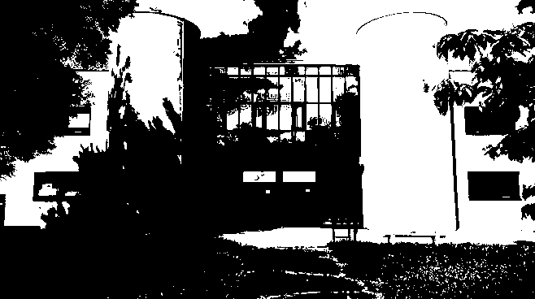

# TpRustDithering

## Question 1

<i>Créer un nouveau projet Cargo, avec une dépendance sur la bibliothèque image, version 0.24.</i>

```bash
cargo new ditherpunk
cd ditherpunk
cargo add image@0.24
cargo add argh
```

## Question 2

*Pour ouvrir une image depuis un fichier, quelle bibliotheque utilise t'on?*

Pour ouvrir une image, on utilise <code> ImageReader </code>

Exemple d'utilisation :

```rust
use image::io::Reader as ImageReader;

let img = ImageReader::open(path_in)?.decode()?;
```

*On obtient un DynamicImage, à quoi correspond ce type?*

Un DynamicImage est une énumération englobant les formats pris en charge par ImageBuffer, permettant des conversions entre eux.

*Comment obtenir une image en mode rbg8 ?*

On utilise la methode <code>to_rgb8</code> du type DynamicImage

Exemple d'utilisation :

```rust
let rgb_image = img.to_rgb8();
```

## Question 3

*Sauver l’image obtenue au format png. Que se passe-t-il si l’image de départ avait un canal alpha?*

Si l'image avait déjà un canal alpha au départ, sachant que png est un format qui comporte déjà un canal alpha, elle ne sera donc pas modifée, de plus, l'utilisation du type <code>DynamicImage</code> prend déjà en charge ce genre de problématiques.

## Question 4

La couleur du pixel (32, 52) est : Rgb([8, 8, 8]).

## Question 6

D'apres [nos recherches](https://stackoverflow.com/questions/596216/formula-to-determine-perceived-brightness-of-rgb-color) la formule pour caluler la luminosité d'un pixel est :

```rust
(0.2126*R + 0.7152*G + 0.0722*B)
```

## Question 7

Voici le resultat :



