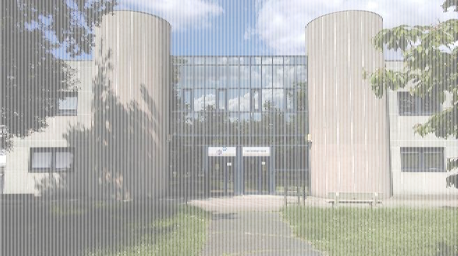
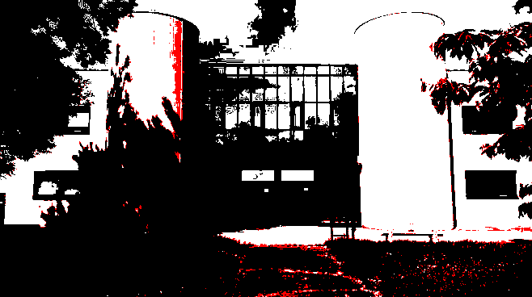

# TpRustDithering

## Question 1

*Créer un nouveau projet Cargo, avec une dépendance sur la bibliothèque image, version 0.24.*

```bash
cargo new ditherpunk
cd ditherpunk
cargo add image@0.24
cargo add argh
```

## Question 2

*Pour ouvrir une image depuis un fichier, quelle bibliotheque utilise t'on?*

Pour ouvrir une image, on utilise <code> ImageReader </code>

Exemple d'utilisation :

```rust
use image::io::Reader as ImageReader;

let img = ImageReader::open(path_in)?.decode()?;
```

*On obtient un DynamicImage, à quoi correspond ce type?*

Un DynamicImage est une énumération englobant les formats pris en charge par ImageBuffer, permettant des conversions entre eux.

*Comment obtenir une image en mode rbg8 ?*

On utilise la methode <code>to_rgb8</code> du type DynamicImage

Exemple d'utilisation :

```rust
let rgb_image = img.to_rgb8();
```

## Question 3

*Sauver l’image obtenue au format png. Que se passe-t-il si l’image de départ avait un canal alpha?*

Si l'image avait déjà un canal alpha au départ, sachant que png est un format qui comporte déjà un canal alpha, elle ne sera donc pas modifée, de plus, l'utilisation du type <code>DynamicImage</code> prend déjà en charge ce genre de problématiques.

## Question 4

*Afficher dans le terminal la couleur du pixel (32, 52) de l’image de votre choix.*

La couleur du pixel (32, 52) est : Rgb([8, 8, 8]).

## Question 5

*Passer un pixel sur deux d’une image en blanc. Est-ce que l’image obtenue est reconnaissable?*

Oui, l'image est reconnaissable : 

## Question 6

D'apres [nos recherches](https://stackoverflow.com/questions/596216/formula-to-determine-perceived-brightness-of-rgb-color) la formule pour caluler la luminosité d'un pixel est :

```rust
(0.2126*R + 0.7152*G + 0.0722*B)
```

## Question 7

Voici le resultat :


## Question 8
*Comment calculer la distance entre deux couleurs?*

Nous pouvons lancer le traitement monochrome avec des couleurs de notre choix avec la commande suivante:

```bash
cargo run ./img/image_iut.jpg -- couleurs --couleurs "WHITE,BLUE"
# Le nom des couleurs doit être en majuscule et en anglais (BLACK, WHITE, RED, GREEN, BLUE, YELLOW, CYAN, MAGENTA, GREY)
```

## Question 9
*Implémentation*

La distance entre deux couleurs peut être évaluée de plusieurs façons. Une méthode populaire consiste à utiliser la distance euclidienne dans l’espace colorimétrique RVB (Rouge, Vert, Bleu).

La distance euclidienne entre deux couleurs C<sub>1</sub> = (R<sub>1</sub>, G<sub>1</sub>, B<sub>1</sub>) et C<sub>2</sub> = (R<sub>2</sub>, G<sub>2</sub>, B<sub>2</sub>) est calculée à l’aide de la formule suivante :

$$
d(C_1, C_2) = \sqrt{(R_1 - R_2)^2 + (G_1 - G_2)^2 + (B_1 - B_2)^2}
$$

Cette formule fournit une mesure de la différence entre deux couleurs en termes de teinte, de saturation et de luminosité. Une distance faible indique que les couleurs sont très similaires.

## Question 10

Avec la commande suivante :

```bash
cargo run ./img/image_iut.jpg -- palette --n-couleurs 8
```

Nous obtenons le résultat suivant : 

## Question 11
*Implémenter le tramage aléatoire des images*

Nous avons implémenter le tramage aléatoire de la manière suivante :
```rust
fn tramage_aleatoire(rgb_image: &mut image::RgbImage) {
    let mut rng = rand::thread_rng();
    let mut random = 0;
    for (x, y, pixel) in rgb_image.enumerate_pixels_mut() {
        random = rng.gen_range(0..255);
        if get_luminance(pixel) > random as f32 {
            *pixel = WHITE;
        } else {
            *pixel = BLACK;
        }
    }
    rgb_image
        .save_with_format("./output/output_tramage_aleatoire.png", image::ImageFormat::Png)
        .unwrap();
}
```