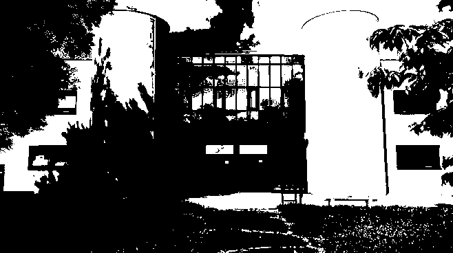
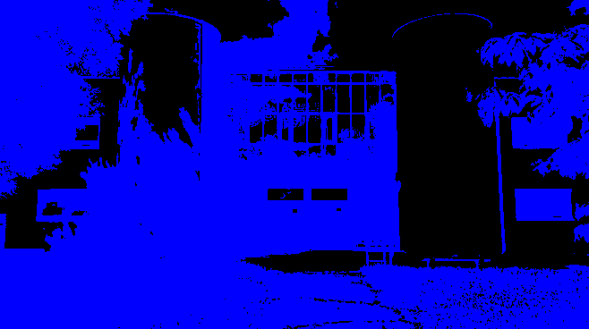
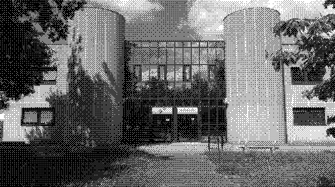
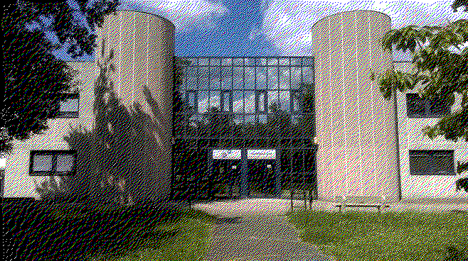
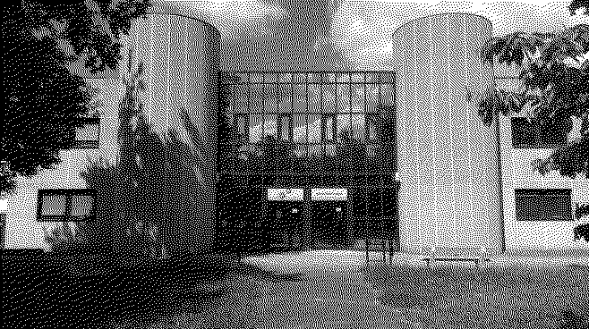

# TpRustDithering

## Question 1

*Créer un nouveau projet Cargo, avec une dépendance sur la bibliothèque image, version 0.24.*

```bash
cargo new ditherpunk
cd ditherpunk
cargo add image@0.24
cargo add argh
```

## Question 2

*Pour ouvrir une image depuis un fichier, quelle bibliothèque utilise-t-on ?*

Pour ouvrir une image, on utilise la bibliothèque **`ImageReader`**.

Exemple d'utilisation :

```rust
use image::io::Reader as ImageReader;

let img = ImageReader::open(path_in)?.decode()?;
```

*On obtient un DynamicImage, à quoi correspond ce type ?*

Un **`DynamicImage`** est une énumération qui englobe les formats pris en charge par **`ImageBuffer`**, permettant des conversions entre eux.

*Comment obtenir une image en mode RGB8 ?*

On utilise la méthode **`to_rgb8`** du type **`DynamicImage`**.

Exemple d'utilisation :

```rust
let rgb_image = img.to_rgb8();
```

## Question 3

*Sauver l’image obtenue au format PNG. Que se passe-t-il si l’image de départ avait un canal alpha ?*

Si l'image avait déjà un canal alpha au départ, étant donné que PNG est un format prenant en charge le canal alpha, celui-ci ne sera pas modifié. Le type **`DynamicImage`** prend déjà en charge ce genre de problématiques.

## Question 4

*Afficher dans le terminal la couleur du pixel (32, 52) de l’image de votre choix.*

La couleur du pixel (32, 52) est : **Rgb([8, 8, 8])**.

## Question 5

*Passer un pixel sur deux d’une image en blanc. Est-ce que l’image obtenue est reconnaissable ?*

Oui, l'image est reconnaissable :


## Question 6

D'après [nos recherches](https://stackoverflow.com/questions/596216/formula-to-determine-perceived-brightness-of-rgb-color), la formule pour calculer la luminosité d'un pixel est :

```rust
(0.2126*R + 0.7152*G + 0.0722*B)
```

## Question 7

Voici le résultat :



## Question 8

*Comment calculer la distance entre deux couleurs ?*

Nous pouvons lancer le traitement monochrome avec des couleurs de notre choix avec la commande suivante :

```bash
cargo run ./img/image_iut.jpg -- couleurs --couleurs "WHITE,BLUE"
# Le nom des couleurs doit être en majuscule et en anglais (BLACK, WHITE, RED, GREEN, BLUE, YELLOW, CYAN, MAGENTA, GREY)
```

Voici le résultat :



## Question 9

*Implémentation*

La distance entre deux couleurs peut être évaluée de plusieurs façons. Une méthode populaire consiste à utiliser la distance euclidienne dans l’espace colorimétrique RVB (Rouge, Vert, Bleu).

La distance euclidienne entre deux couleurs **C₁** = (R₁, G₁, B₁) et **C₂** = (R₂, G₂, B₂) est calculée à l’aide de la formule suivante :

$$
d(C_1, C_2) = \sqrt{(R_1 - R_2)^2 + (G_1 - G_2)^2 + (B_1 - B_2)^2}
$$

Cette formule fournit une mesure de la différence entre deux couleurs en termes de teinte, de saturation et de luminosité. Une distance faible indique que les couleurs sont très similaires.

## Question 10

Avec la commande suivante :

```bash
cargo run ./img/image_iut.jpg -- palette --n-couleurs 8
```

Nous obtenons le résultat suivant :


## Question 11

Si la palette est vide, le programme envoie un message indiquant que la palette ne doit pas être vide et ne fait rien.

## Question 12

*Implémenter le tramage aléatoire des images*

Nous avons implémenté le tramage aléatoire de la manière suivante :

```rust
fn tramage_aleatoire(rgb_image: &mut image::RgbImage) {
    let mut rng = rand::thread_rng();
    let mut random = 0;
    for (x, y, pixel) in rgb_image.enumerate_pixels_mut() {
        random = rng.gen_range(0..255);
        if get_luminance(pixel) > random as f32 {
            *pixel = WHITE;
        } else {
            *pixel = BLACK;
        }
    }
    rgb_image
        .save_with_format("./output/output_tramage_aleatoire.png", image::ImageFormat::Png)
        .unwrap();
}
```

## Question 14

*Quel type de données utiliser pour représenter la matrice de Bayer ?*

Pour représenter la matrice de Bayer, on peut utiliser un vecteur de vecteurs d'entiers :

```rust
Vec<Vec<u32>>
```

## Question 15

Avec la commande suivante, `cargo run ./img/image_iut.jpg -- bayer --ordre 4`, nous obtenons le résultat suivant :



## Question 16

Après avoir implémenté la diffusion d'erreur, voici ce que nous obtenons :


## Question 17

### Représentation de l'erreur avec une palette de couleurs

Lorsque l'on travaille avec une palette de couleurs, chaque pixel est représenté par une couleur composée de trois canaux : Rouge (R), Vert (G) et Bleu (B). Contrairement au noir et blanc, où l'erreur est une valeur scalaire (la différence de luminosité), ici l'erreur est un **vecteur à trois dimensions**.

#### Calcul de l'erreur

L'erreur est calculée pour chaque canal de couleur séparément :
- Si \( C_{\text{réel}} = (R, G, B) \) est la couleur réelle d'un pixel.
- Et \( C_{\text{approché}} = (R', G', B') \) est la couleur de la palette choisie pour ce pixel.  

Alors l'erreur est définie comme :

\[ \text{Erreur} = (R - R', G - G', B - B') \]

Chaque composante de ce vecteur représente l'écart entre la couleur réelle et la couleur choisie dans la palette pour les canaux Rouge, Vert et Bleu.

#### Diffusion de l'erreur

L'erreur est ensuite répartie sur les pixels voisins qui n'ont pas encore été traités. La diffusion suit une matrice prédéfinie, où chaque pixel voisin reçoit une fraction de l'erreur.

Par exemple, pour la matrice :

```
  *   0.5
0.5   0
```

- \( * \) représente le pixel en cours de traitement.
- \( 0.5 \) signifie que **50% de l'erreur** est ajoutée au pixel de droite et **50% de l'erreur** au pixel en dessous.

Pour chaque pixel voisin, on additionne l'erreur diffusée pour chaque canal (R, G, B) avant de calculer sa propre couleur approximée.

## Question 18

Nous avons implémenté la diffusion d'erreur pour la palettisation d'images. Pour cela, nous avons réutilisé notre algorithme de la distance euclidienne entre deux couleurs. Voici ce que nous obtenons :



## Question 19

Après avoir implémenté la diffusion d'erreur avec la matrice de Floyd-Steinberg, voici le résultat obtenu :



## Question 22

Le type Rust correspondant à une sélection d’options fournies par l’utilisateur est, en reprenant le squelette qui nous était donné, **`DitherArgs`**, qui dérive le type **`FromArgs`** de la bibliothèque **`argh`**.